# Installing a Working RE_Kenshi Plugin Build Setup on Windows

This guide only covers what has been **proven out** in practice so far while getting a working RE_Kenshi / KenshiLib plugin built and loaded for Kenshi on Windows.

It is written for the known-working path:

- Windows
- Visual Studio
- KenshiLib example/deps setup
- building a C++ DLL plugin
- RE_Kenshi loading that DLL successfully in-game

It does **not** try to cover every possible setup.

---

## Optional AI / Serena code intelligence setup

This repo includes optional helper files for people using AI coding tools, Serena, clangd, or other tools that understand `compile_commands.json`.

You do **not** need this to build or run the Kenshi plugins. It is only here to make code navigation less painful once the repo and dependencies are already on disk.

From the repo root, run:

```powershell
powershell -ExecutionPolicy Bypass -File tools\refresh_serena.ps1
```

That script:

- regenerates `compile_commands.json` from the remaining Visual Studio C++ projects
- infers the usual sibling deps folder when env vars are missing, such as `<parent>\<repo-name>_deps`
- re-indexes Serena if the `serena` command is available on `PATH`

If you only want the compile database and do not use Serena, run:

```powershell
powershell -ExecutionPolicy Bypass -File tools\generate_compile_commands.ps1
```

`compile_commands.json` is intentionally ignored by git because it contains local absolute paths. If you copy this repo and delete projects to make a smaller learning repo, run the script again and it will regenerate entries only for the remaining `*.vcxproj` files.

In VS Code, the included task **Refresh Serena** runs the same refresh script.

---

## Part 1. Set up dependencies and toolchain

## 1. What you should have before you start

You need these pieces available locally:

- a copy of **RE_Kenshi**
- a copy of **[KenshiLib examples](https://github.com/BFrizzleFoShizzle/KenshiLib_Examples/)**
- the matching **[KenshiLib deps](https://github.com/BFrizzleFoShizzle/KenshiLib_Examples_deps)** package
- **[Git LFS](https://github.com/git-lfs/git-lfs)** installed
  - On Windows you can get it through [Git for Windows](https://gitforwindows.org/) or [Chocolatey](https://chocolatey.org/)
- Boost extracted from the deps package if it is shipped as a zip
- **Visual Studio** installed with C++ support
- the **Visual C++ 2010 x64 toolchain** available so `v100` appears in project settings

### Notes on Visual Studio / toolchain

A newer Visual Studio can still be used as the IDE, but the working setup here depended on the old `v100` toolset being installed.

A practical path that worked was:

- keep your normal Visual Studio install
- also install the Visual C++ 2010 x64 tools
- open the solution in your newer Visual Studio, but build with `v100`

At your own risk, one path that worked was using the **Visual Studio 2010 Ultimate ISO** and installing only:

- `Visual C++`
  - `X64 Compilers and Tools`

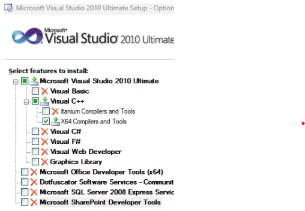

---

## 2. Install Git LFS first

This matters because `KenshiLib.lib` may be stored via Git LFS. If Git LFS is missing, the `.lib` file may just be a tiny text pointer file instead of the real binary.

### How to check

Open the supposed library file in Notepad if builds fail with a corrupt library error.

If it looks like this:

```
version https://git-lfs.github.com/spec/v1
oid sha256:...
size ...
```

or it shows `0 KB` on disk, then you do **not** have the real `.lib`.

### Fix

Install Git LFS, then from the correct repo root run:

```
git lfs install
git lfs pull
```

If needed:

```
git lfs checkout
```

And you should now have valid libraries

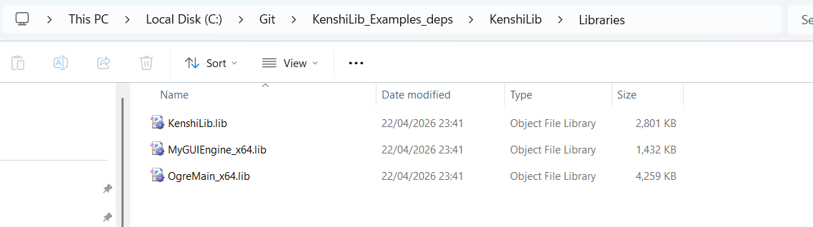

---

## 3. Get the example and deps folders into place

Before doing any Visual Studio work, make sure your folders are laid out cleanly and predictably.

You should have something like:

```
C:\Git\KenshiLib_Examples
C:\Git\KenshiLib_Examples_deps
```

And inside the deps folder, the important subfolders should exist as real folders, not broken stubs.

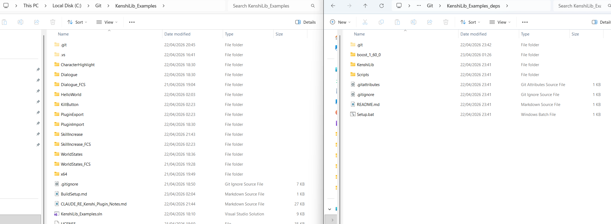

---

## 4. Extract Boost correctly

This was a proven problem.

### What you want

Both of these must be present:

```
C:\...\boost_1_60_0\boost\unordered_map.hpp
C:\...\boost_1_60_0\stage\lib\libboost_thread-vc100-mt-1_60.lib
```

The `stage\lib` folder is required for linking, not just the headers. If it is missing or empty, the linker will fail even if headers compile fine.

### What you do not want

Not this, which is what you likely have out of the box:

```
...\boost_1_60_0\boost.zip
```

And also not this accidental nested form from some unarchivers:

```
...\boost_1_60_0\boost\boost\unordered_map.hpp
```

The `boost` folder **inside** the zip is the one you need.

Bad

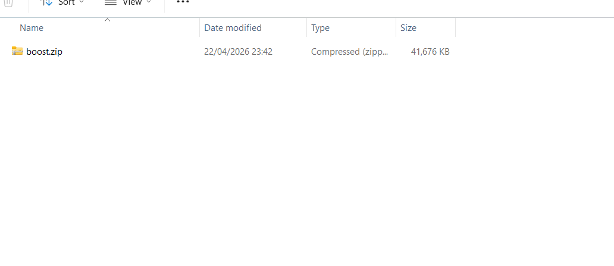

Good

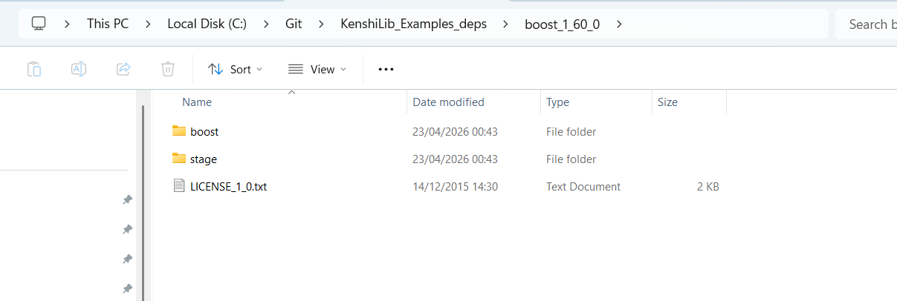

---

## 5. Run the setup `.bat`

Before opening the solution in Visual Studio, run the setup batch file that comes with the KenshiLib example/deps setup.

Its job is to set the environment variables used by the example projects, especially:

- `KENSHILIB_DIR`
- `BOOST_INCLUDE_PATH`

If you skip this step, Visual Studio may show the variables in project settings but still fail to resolve headers or libraries correctly.

### What to do

1. Find the setup `.bat` that comes with the example/deps package.
2. Run it.
3. Close and reopen Visual Studio if it was already open.

### Important note

If you later move your KenshiLib or Boost folders, run the `.bat` again so the environment variables point to the new locations.

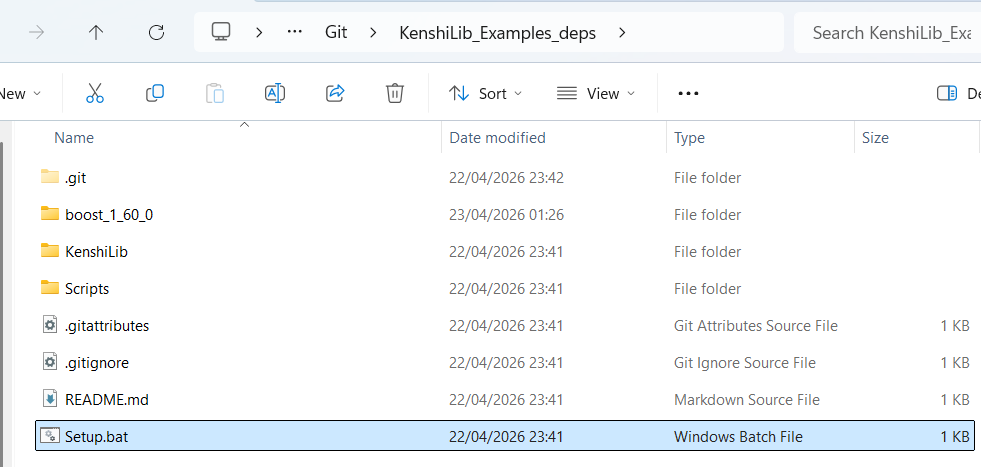

---

## 6. Verify environment variables on Windows

The two important ones are:

- `KENSHILIB_DIR`
- `BOOST_INCLUDE_PATH`

### How to check them

```
echo %KENSHILIB_DIR%
echo %BOOST_INCLUDE_PATH%
```

You should see real paths, not blank output.

### What they should point to

`KENSHILIB_DIR` should point to the KenshiLib folder that contains `Include` and `Libraries`.

`BOOST_INCLUDE_PATH` should point to the extracted Boost root folder that contains **both**:

- `boost\` (headers)
- `stage\lib\` (pre-built libraries)

For example:

```
KENSHILIB_DIR      = C:\Git\KenshiLib_Examples_deps\KenshiLib_Examples_deps\KenshiLib
BOOST_INCLUDE_PATH = C:\Git\KenshiLib_Examples_deps\KenshiLib_Examples_deps\boost_1_60_0
```

Close and reopen Visual Studio after any env var change.

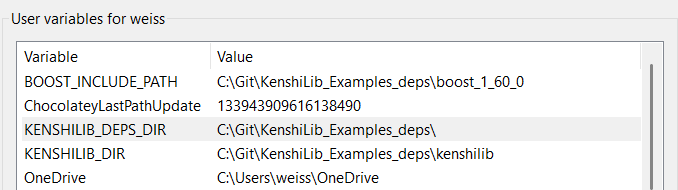

---

## 7. Make sure the `v100` toolset is available

If `v100` does not appear in the Platform Toolset dropdown, the Visual C++ 2010 tools are not installed correctly yet.

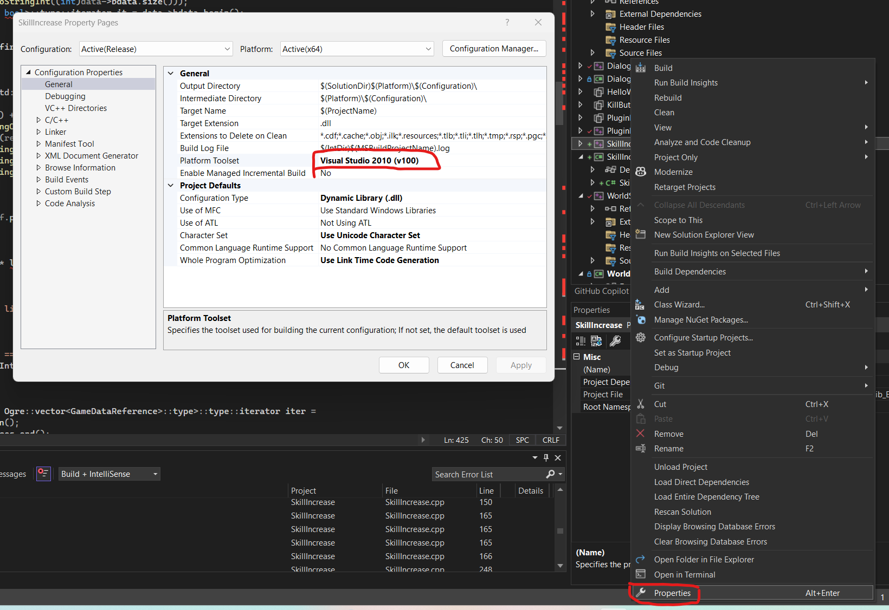

---

## Part 2. Validate the working example

## 8. Open the example solution and start with `HelloWorld`

Do **not** start by creating your own plugin project. Get `HelloWorld` building first.

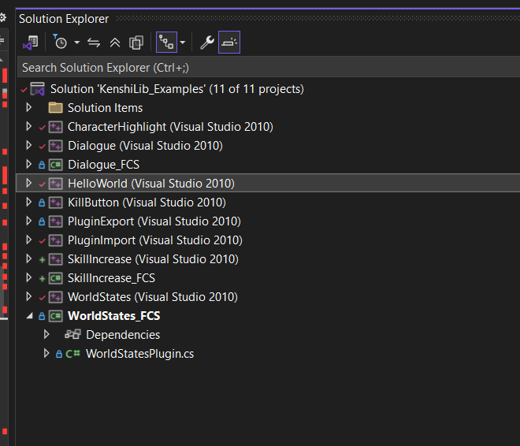

---

## 9. Fix and verify the `HelloWorld` project settings first

**Project -> Properties -> Configuration Properties -> General**

- **Configuration Type** = `Dynamic Library (.dll)`
- **Platform Toolset** = `v100`
- **Character Set** = `Use Unicode Character Set`
- **Configuration** = `Release`
- **Platform** = `x64`

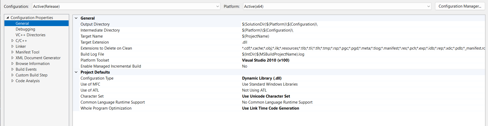


---

## 10. Verify VC++ Settings (Include and libraries directories)

**Configuration Properties -> VC++ Directories -> General -> Include Directories**

```
$(KENSHILIB_DEPS_DIR);$(KENSHILIB_DIR)/Include;$(BOOST_INCLUDE_PATH);$(IncludePath)
```

**Configuration Properties -> VC++ Directories -> General -> Library Directories**

```
$(BOOST_ROOT)/stage/lib;$(KENSHILIB_DIR)/Libraries/;$(LibraryPath)
```

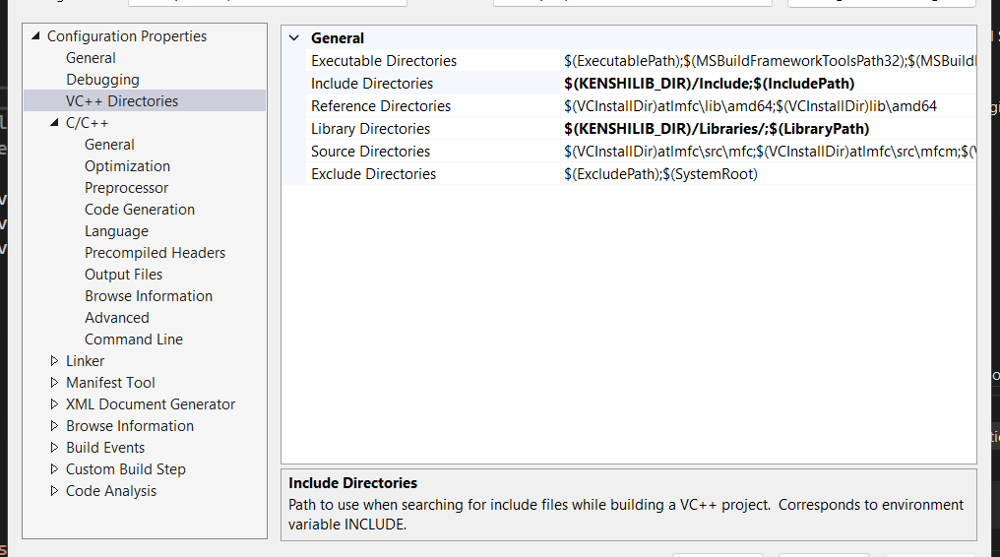


### Important notes

- `$(BOOST_INCLUDE_PATH)` must be the **Boost root**, not the inner `boost` subfolder
  - Correct: `C:\...\boost_1_60_0`
  - Wrong: `C:\...\boost_1_60_0\boost`
- This setting is under **C/C++ -> General** — do not confuse it with the top-level **General** configuration page

### Why `$(BOOST_INCLUDE_PATH)\stage\lib` is required
`kenshilib.lib` has a **transitive dependency** on Boost thread libraries. Even though your plugin code never uses Boost directly, the linker still needs to find `libboost_thread-vc100-mt-1_60.lib` when linking against `kenshilib.lib`. Without this path the linker fails with:

```
LNK1104 cannot open file 'libboost_thread-vc100-mt-1_60.lib'
```

Verify the files exist:

```
C:\...\boost_1_60_0\stage\lib\libboost_thread-vc100-mt-1_60.lib
```

If that folder is empty, check that `stage\lib` exists and is not empty before proceeding.

### Summary of what each path provides

| Path | What it provides |
|---|---|
| `$(KENSHILIB_DIR)\Libraries` | `kenshilib.lib` — direct dependency |
| `$(BOOST_INCLUDE_PATH)\stage\lib` | Boost `.lib` files — transitive dependency via kenshilib |
| `$(LibraryPath)` | System/Visual Studio defaults |

---

## 13. (Optional Sanity Check) Verify the expanded include and library paths

Use Visual Studio's expanded path view to confirm:

- include path contains your KenshiLib `Include` and Boost root
- library path contains your KenshiLib `Libraries` and Boost `stage\lib`

This catches wrong slash direction, double-nesting, and missing extractions.

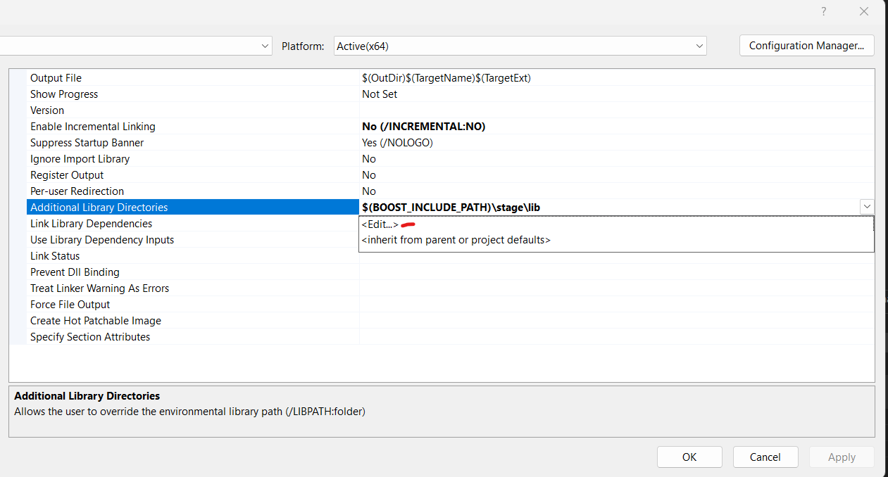

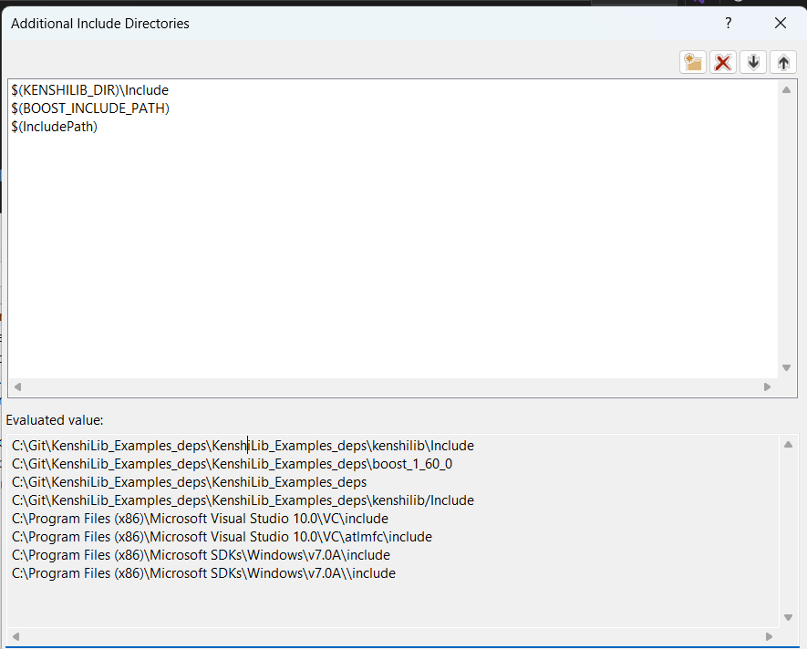

---

## 11. Verify C/C++ & Linker Settings (Additional Include Directories)
**Configuration Properties -> C/C++ -> General -> Additional Include Directories**

```
$(KENSHILIB_DIR)\Include;$(BOOST_INCLUDE_PATH);$(IncludePath)
```

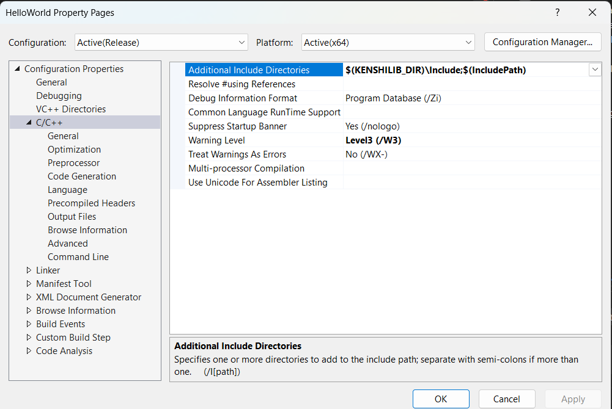

**Configuration Properties -> Linker -> General -> Additional Library Directories**

```
$(BOOST_INCLUDE_PATH)\stage\lib
```

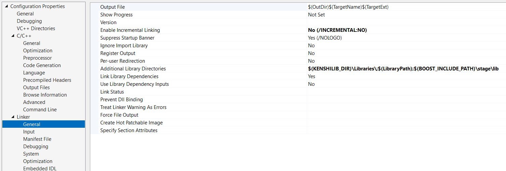

**Configuration Properties -> Linker -> Input -> Additional Dependencies**

```
kenshilib.lib;%(AdditionalDependencies)
```

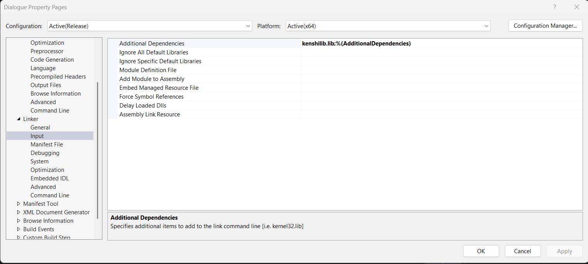


---

## 12. Build `HelloWorld`

A successful build proves compiler, include paths, and library linking all work.

Do **not** jump to your custom plugin before this succeeds. usually you can find the .dll in /{platform}/{release}/ in the solution root if you open the entire solution, if you opened just the project it should be in the project root in the same nested folder structure.

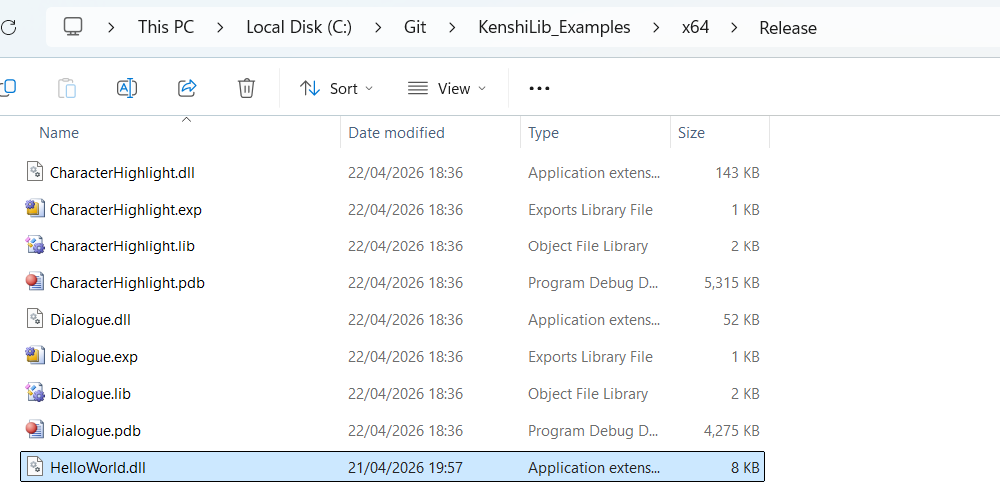

---

## 13. Confirm RE_Kenshi can load the example DLL

Put the DLL in the mod/plugin location from the release folder and create `RE_Kenshi.json`:

```json
{
  "Plugins": [
    "HelloWorld.dll"
  ]
}
```

You should have in your `Kenshi/mods` folder

- HelloWorld Folder containing:
 - HelloWorld.mod 
   - no contents needed, only so Kenshi picks up the folder.
 - RE_Kenshi.json
 - HelloWorld.dll

There should be a working folder inside the example repo that has a working copy of the mod without the .dll, you can copy this entire folder to mods and just drop the .dll in.

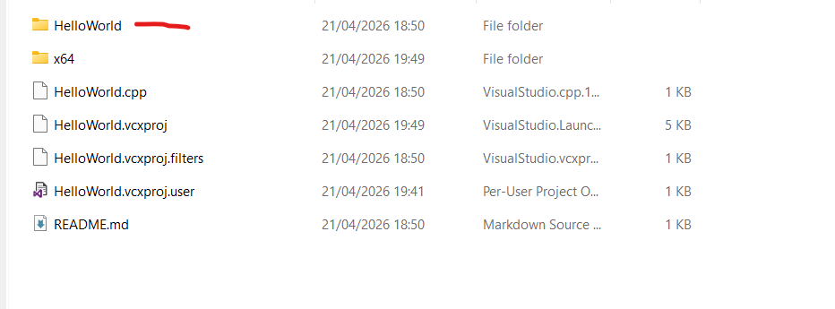
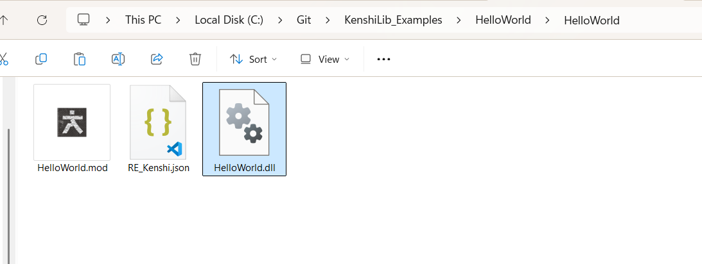


The startup log message appearing in the RE_Kenshi log is the first real proof the whole chain works.

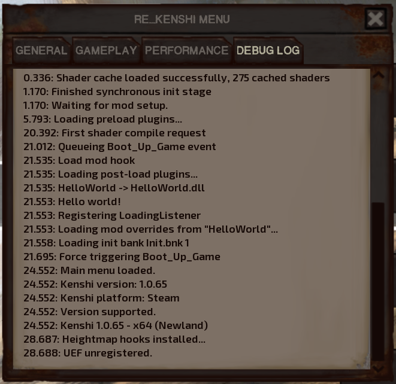

---

## Part 3. Create your own plugin from the working example

## 14. Duplicate `HelloWorld` only after it builds

1. fix and verify `HelloWorld`
2. build `HelloWorld`
3. duplicate it afterward

The copied project inherits all working settings.

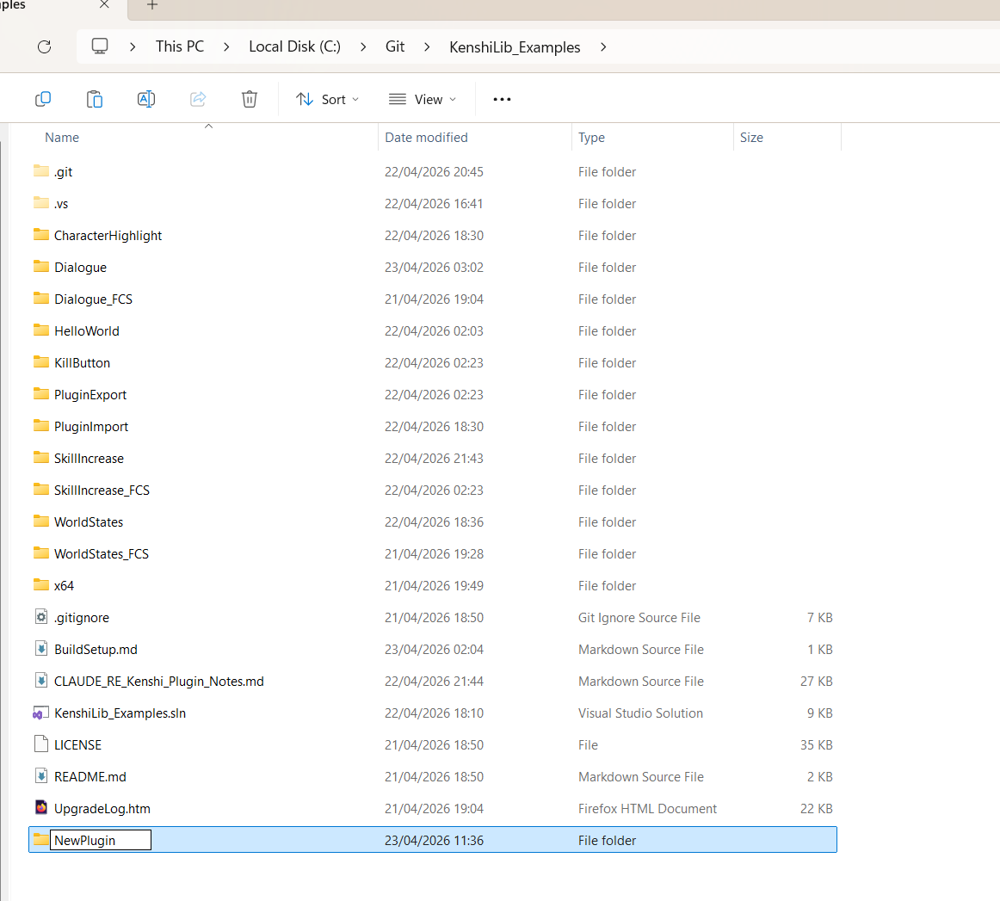

---

## 15. Rename the copied project

Do this in File Explorer, outside Visual Studio. Rename:

- the project folder
- the `.vcxproj`
- the `.vcxproj.filters` if present
- the main `.cpp` if you want
- the project name inside the solution if you want it tidy

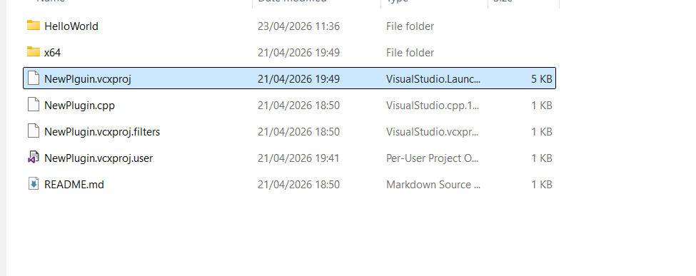

---


## 16. Build only your plugin project, not the whole solution

Right-click the project -> **Build**, or use **Project Only -> Build Only [ProjectName]**.

This avoids being blocked by unrelated example projects with missing dependencies.

### Screenshot placeholder
<!-- Insert screenshot: building one project only in Solution Explorer -->

---

## 20. Confirm RE_Kenshi loads your DLL


```json
{
  "Plugins": [
    "NewProject.dll"
  ]
}
```

Your hellow world startup log message in RE_Kenshi confirms it is working.

---

## Troubleshooting

## 21. Common build failures that were actually hit

### 21.1 `LNK1107 invalid or corrupt file`

`KenshiLib.lib` was a Git LFS pointer file, not a real binary.

Fix: install Git LFS and run `git lfs install` then `git lfs pull`.

### 21.2 `fatal error C1083: Cannot open include file: 'boost/unordered_map.hpp'`

Boost include path was wrong or Boost was still zipped.

Fix: extract Boost and point `BOOST_INCLUDE_PATH` at the Boost root, not the inner `boost` subfolder.

### 21.3 `LNK1104 cannot open file 'libboost_thread-vc100-mt-1_60.lib'`

This is a **transitive dependency** issue. `kenshilib.lib` depends on Boost thread internally. Your plugin code does not need to use Boost directly, but the linker still needs to find the Boost `.lib` files.

Fix: add `$(BOOST_INCLUDE_PATH)\stage\lib` to **Linker -> General -> Additional Library Directories**.

Verify the file exists:

```
C:\...\boost_1_60_0\stage\lib\libboost_thread-vc100-mt-1_60.lib
```

If it is missing entirely, check that `stage\lib` exists and is not empty.

Note: if only unrelated example projects hit this and your own plugin builds, you do not need to solve it immediately.

---

## 22. Known-good stopping point

Setup is working when all of these are true:

- `HelloWorld` builds successfully
- your custom plugin DLL builds successfully
- RE_Kenshi loads the DLL
- startup log message appears in RE_Kenshi log

Only after this should you move on to hooking game functions, custom dialogue behavior, `fcs.def`, or custom data types.

---

## 23. Quick checklist

### Deps/toolchain
- [ ] Git LFS installed
- [ ] real `KenshiLib.lib`, not a pointer file
- [ ] Boost extracted (not just `boost.zip`)
- [ ] `BOOST_INCLUDE_PATH` points to `boost_1_60_0` root (not the inner `boost` subfolder)
- [ ] `KENSHILIB_DIR` points to KenshiLib root (contains `Include` and `Libraries`)
- [ ] `stage\lib` exists under Boost root and contains `.lib` files
- [ ] setup `.bat` has been run
- [ ] Visual Studio reopened after env var changes
- [ ] `v100` is available

### Project settings
- [ ] project is `Release | x64`
- [ ] project type is `Dynamic Library (.dll)`
- [ ] **VC++ -> General**: Include Directories contains `$(KENSHILIB_DEPS_DIR);$(KENSHILIB_DIR)/Include;$(BOOST_INCLUDE_PATH);$(IncludePath)`
- [ ] **VC++ -> General**: Library Directories contains `$(BOOST_ROOT)/stage/lib;$(KENSHILIB_DIR)/Libraries/;$(LibraryPath)`
- [ ] **C/C++ -> General**: Additional Include Directories contains `$(KENSHILIB_DIR)\Include;$(BOOST_INCLUDE_PATH);$(IncludePath)`
- [ ] **Linker -> General**: Additional Library Directories `$(KENSHILIB_DIR)\Libraries\;$(LibraryPath);$(BOOST_INCLUDE_PATH)\stage\lib`
- [ ] **Linker -> Input**: Additional Dependencies contains `kenshilib.lib;%(AdditionalDependencies)`

### Runtime
- [ ] DLL built successfully
- [ ] DLL copied into mod folder
- [ ] `RE_Kenshi.json` points at the DLL
- [ ] plugin startup log appears in RE_Kenshi

---

## 24. Suggested screenshot slots summary


13. successful `HelloWorld` build
14. copied/renamed project files
15. Target Name / output DLL settings
16. RE_Kenshi log showing plugin loaded

---

## 25. Final note

This guide only covers the path that has been **proven working so far**.

It does **not** try to be a universal Kenshi plugin setup guide.

If something differs from this path, prefer the working example-project route first before experimenting.
